# RFC-0001: Core Architecture

**Status:** Draft

**Author:** Himanshu Pathak

**Created:** 2026-07-12

---

## Scope

This RFC defines the core architectural principles, system boundaries, and high-level component model of AEGIS.

Detailed designs for individual subsystems (such as the plugin system, adapter interfaces, evaluation engines, scoring model, and reporting formats) are intentionally deferred to separate RFCs.

---

## Summary

<Ye wahi final summary hogi jo hum review karke finalize karenge.>

---

## Motivation

Traditional software engineering relies on well-established quality gates before deployment, including linting, automated testing, security scanning, and continuous integration. These practices provide engineering teams with confidence that software behaves as expected under known conditions.

AI systems introduce fundamentally different failure modes that cannot be sufficiently validated through traditional software testing alone. Their behavior depends not only on code, but also on prompts, external tools, retrieval systems, memory, model behavior, and other dynamic components. As a result, evaluating AI systems requires new forms of testing that extend beyond conventional engineering practices.

Unlike traditional software, AI systems currently lack a reproducible engineering workflow that enables teams to answer a simple question before deployment:

> **Can we trust the behavior of this AI system under realistic and adversarial conditions?**

Existing evaluation approaches are often fragmented, manual, provider-specific, or difficult to integrate into engineering workflows. This makes AI evaluation inconsistent, difficult to reproduce, and challenging to automate within modern software delivery pipelines.

This gap motivates the development of AEGIS: a framework that aims to establish a reproducible engineering workflow for evaluating AI systems within modern software delivery processes.

---

## Goals

### Functional Goals

- Establish a repeatable engineering workflow for evaluating AI systems before deployment.
- Enable software engineering teams to evaluate AI systems without requiring specialized expertise in AI safety research.
- Provide a reproducible evaluation methodology supported by evidence, traceability, and replayable execution records.
- Integrate AI evaluation into existing software engineering and CI/CD workflows.
- Generate actionable, evidence-based findings that help engineering teams evaluate and improve the overall quality and operational behavior of AI systems.

### Architectural Goals

- Maintain a provider-agnostic architecture through stable adapter interfaces.
- Support extensibility through independently developed plugins and evaluation engines.
- Build a modular platform where discovery, planning, execution, evaluation, scoring, and reporting remain independently evolvable.

---

## Non-Goals

- AEGIS is not an AI agent framework or orchestration platform.
- AEGIS is not an LLM provider abstraction layer or model serving framework.
- AEGIS uses adversarial techniques strictly to evaluate and report on system behavior—it is not designed or intended to exploit, compromise, or gain unauthorized access to production systems.
- AEGIS is not an academic benchmarking or leaderboard framework for comparing foundation models.
- AEGIS does not replace human engineering judgment, security reviews, or organizational governance processes.
- AEGIS does not automatically modify, patch, or deploy production systems.
- AEGIS does not guarantee that an AI system is secure, reliable, correct, or free from vulnerabilities; instead, it provides reproducible evidence to support informed engineering decisions.
---

## Proposed Architecture

### Architectural Principles

The architecture of AEGIS is guided by a small set of principles that define how the system evolves over time. These principles are intended to constrain architectural decisions throughout the project rather than describe implementation details.

#### 1. Provider Independence

The core architecture MUST remain independent of any specific LLM provider, orchestration framework, or AI SDK.

All communication with target AI systems MUST occur through stable adapter interfaces. Provider-specific behavior is isolated within adapters and MUST NOT leak into the core architecture.

#### 2. Evidence Before Verdict

Every evaluation result MUST be supported by reproducible evidence.

Architectural components are expected to produce traceable execution records that enable findings to be inspected, replayed, and independently verified. Reports and scores are derived from evidence rather than opaque evaluation outcomes.

#### 3. Separation of Responsibilities

Each architectural component is responsible for a single stage of the evaluation workflow.

Discovery, planning, execution, evaluation, scoring, and reporting are independent responsibilities that communicate only through well-defined interfaces. Components SHOULD remain loosely coupled and independently evolvable.

#### 4. Extensibility by Default

The core architecture SHOULD remain intentionally small.

New evaluation capabilities, attack techniques, reporting formats, adapters, and integrations SHOULD be introduced through extensions instead of modifications to the core system whenever practical.

#### 5. Defensive by Design

AEGIS is designed exclusively for defensive evaluation.

Potentially destructive evaluation techniques MUST execute only within explicitly authorized environments. The architecture assumes safe evaluation, controlled execution, and responsible disclosure as fundamental design requirements.

#### 6. Reproducibility over Determinism

AI systems are inherently non-deterministic.

Rather than guaranteeing identical outputs across executions, AEGIS guarantees reproducible evaluation methodology, execution evidence, and traceability. Engineering decisions are based on reproducible process rather than deterministic model behavior.

### Core Components

The AEGIS architecture is composed of a set of independent components, each responsible for a single stage of the evaluation workflow. Every component exposes a well-defined contract, communicates through explicit interfaces, and owns a clearly defined responsibility.

---

#### Configuration Resolver

**Responsibility**

Resolve and normalize all runtime configuration required for a scan.

**Consumes**

- CLI arguments
- Configuration files
- Environment variables
- Default configuration

**Produces**

- Normalized scan configuration

**Must Not**

- Discover target capabilities.
- Execute evaluation logic.
- Interact with target AI systems.

---

#### Extension Registry

**Responsibility**

Discover, validate, and expose available architectural extensions to the core system.

**Consumes**

- Installed extensions
- Runtime configuration

**Produces**

- Registered extensions
- Extension metadata

**Must Not**

- Execute evaluations.
- Select attack plans.
- Modify evaluation results.

---

#### Discovery Engine

**Responsibility**

Discover the capabilities of the target AI system and construct a capability model for planning.

**Consumes**

- Normalized scan configuration
- Agent Adapter
- Extension Registry

**Produces**

- Capability graph

**Must Not**

- Execute attacks.
- Produce evaluation scores.
- Generate reports.

---

#### Attack Planner

**Responsibility**

Generate an evaluation plan based on the discovered capabilities of the target system.

**Consumes**

- Capability graph
- Extension Registry
- Scan configuration

**Produces**

- Attack plan

**Must Not**

- Execute attacks.
- Evaluate results.
- Modify execution evidence.

---

#### Orchestrator

**Responsibility**

Coordinate the execution of the evaluation plan and manage communication between architectural components.

**Consumes**

- Attack plan
- Agent Adapter

**Produces**

- Execution traces

**Must Not**

- Score findings.
- Generate reports.
- Make evaluation decisions.

---

#### Agent Adapter

**Responsibility**

Provide a stable abstraction for communication between AEGIS and target AI systems.

**Consumes**

- Requests from architectural components

**Produces**

- Normalized responses
- Tool interaction events
- Model execution events

**Must Not**

- Perform evaluation logic.
- Score findings.
- Contain provider-specific business logic outside the adapter boundary.

---

#### Evidence Store

**Responsibility**

Persist execution evidence required for traceability, replayability, and reporting.

**Consumes**

- Execution traces

**Produces**

- Evidence references
- Replayable execution records

**Must Not**

- Evaluate findings.
- Generate reports.
- Modify execution history.

---

#### Evaluation Engine

**Responsibility**

Analyze execution evidence and determine evaluation findings.

**Consumes**

- Execution evidence
- Capability context

**Produces**

- Evaluation findings

**Must Not**

- Modify execution evidence.
- Generate reports.
- Calculate final scores.

---

#### Scoring Engine

**Responsibility**

Aggregate evaluation findings into structured scoring outputs.

**Consumes**

- Evaluation findings

**Produces**

- Evaluation scores

**Must Not**

- Execute evaluations.
- Interpret execution evidence directly.
- Generate reports.

---

#### Reporter

**Responsibility**

Generate human-readable and machine-readable reports from evaluation outputs.

**Consumes**

- Evaluation findings
- Evaluation scores
- Evidence references

**Produces**

- Terminal output
- JSON reports
- HTML reports

**Must Not**

- Execute evaluations.
- Modify findings.
- Recalculate scores.
---
### System Interaction Model

The AEGIS evaluation workflow is organized as a sequence of independent architectural stages.

Each stage owns the artifacts it produces and exposes them through stable contracts. Downstream components consume these artifacts but MUST NOT modify them. Ownership is transferred only through the creation of new artifacts rather than mutation of existing ones.

The high-level interaction model is illustrated below.

```mermaid
flowchart LR

    %% =========================
    %% Styles
    %% =========================

    classDef component fill:#fff3e0,stroke:#f57c00,stroke-width:2px,color:#000
    classDef artifact fill:#e8f5e9,stroke:#388e3c,stroke-width:2px,color:#000
    classDef external fill:#ffebee,stroke:#d32f2f,stroke-width:2px,color:#000
    classDef report fill:#f3e5f5,stroke:#7b1fa2,stroke-width:2px,color:#000

    %% =========================
    %% Preparation
    %% =========================

    subgraph "Preparation Stage"
        CR[Configuration Resolver]:::component
        ER[Extension Registry]:::component
        CFG[(Scan Configuration)]:::artifact

        CR --> CFG
    end

    %% =========================
    %% Discovery
    %% =========================

    subgraph "Discovery Stage"
        DE[Discovery Engine]:::component
        ADAPTER_DISC[Agent Adapter]:::component
        CG[(Capability Graph)]:::artifact

        CFG --> DE
        ER --> DE
        DE --> ADAPTER_DISC
        DE --> CG
    end

    %% =========================
    %% Planning
    %% =========================

    subgraph "Planning Stage"
        AP[Attack Planner]:::component
        PLAN[(Attack Plan)]:::artifact

        CG --> AP
        CFG --> AP
        ER --> AP
        AP --> PLAN
    end

    %% =========================
    %% Execution
    %% =========================

    subgraph "Execution Stage"
        ORCH[Orchestrator]:::component
        ADAPTER[Agent Adapter]:::component
        TARGET{{Target AI System}}:::external
        TRACES[(Execution Traces)]:::artifact
        STORE[Evidence Store]:::component
        EVIDENCE_REF[(Evidence References)]:::artifact

        PLAN --> ORCH
        ORCH --> ADAPTER
        ADAPTER --> TARGET
        TARGET --> ADAPTER
        ADAPTER --> ORCH
        ORCH --> TRACES
        TRACES --> STORE
        STORE --> EVIDENCE_REF
    end

    %% =========================
    %% Evaluation
    %% =========================

    subgraph "Evaluation Stage"
        ENGINE[Evaluation Engine]:::component
        FINDINGS[(Evaluation Findings)]:::artifact

        TRACES -.->|direct handoff| ENGINE
        EVIDENCE_REF --> ENGINE
        ENGINE --> FINDINGS
    end

    %% =========================
    %% Reporting
    %% =========================

    subgraph "Reporting Stage"
        SCORE[Scoring Engine]:::component
        SCORES[(Evaluation Scores)]:::artifact
        REPORTER[Reporter]:::component
        REPORT[(HTML / JSON / CLI Reports)]:::report

        FINDINGS --> SCORE
        SCORE --> SCORES

        FINDINGS -.-> REPORTER
        SCORES -.-> REPORTER
        EVIDENCE_REF -.-> REPORTER

        REPORTER --> REPORT
    end
```

The interaction model separates discovery, planning, execution, evaluation, scoring, and reporting into independent architectural stages. Each stage produces a new architectural artifact that becomes the input for subsequent stages. As a general pattern, pipeline stages communicate through artifacts rather than through direct knowledge of one another's internal implementation. The Orchestrator-to-Agent Adapter interaction is an explicit, intentional exception to this pattern: it represents a direct interface-boundary call necessary to execute the evaluation plan against the target system, rather than an artifact-mediated handoff.

The Agent Adapter is the sole communication boundary between the AEGIS core architecture and target AI systems. Provider-specific behavior MUST remain isolated behind this abstraction and MUST NOT propagate into the core architecture.

Execution evidence is the architectural source of truth for the evaluation process. The Orchestrator produces execution traces that are persisted through the Evidence Store, which provides evidence references for downstream stages. The Evaluation Engine receives both direct execution trace handoffs (for immediate analysis) and evidence references (for traceability and replayability). Findings, scores, and reports MUST be derived from recorded execution evidence rather than directly from live interactions with the target system.

## Package Responsibilities

The AEGIS implementation is organized as a collection of independently evolvable packages. Each package owns a single architectural responsibility and exposes its functionality through stable public interfaces.

Packages MUST communicate only through documented architectural contracts. No package may depend upon or assume knowledge of another package's internal implementation.

The initial package organization is expected to follow the responsibilities defined below.

| Package | Responsibility |
|----------|----------------|
| `@aegis/core` | Owns the evaluation workflow, orchestration lifecycle, architectural contracts, and the canonical domain model of the AEGIS architecture. |
| `@aegis/cli` | Provides the command-line interface, configuration loading, user interaction, and the entry point for evaluation workflows. The CLI coordinates execution but MUST NOT contain evaluation or orchestration logic. |
| `@aegis/adapters/*` | Implements provider-specific integrations behind the common Agent Adapter interface. Adapters are responsible for translating provider-specific behavior into architecture-defined contracts without exposing provider implementation details to the core architecture. |
| `@aegis/plugins/*` | Implements independently developed extensions that contribute discovery, planning, evaluation, reporting, or other evaluation capabilities without requiring modifications to the core architecture. |
| `@aegis/reporters/*` | Transforms evaluation artifacts into human-readable and machine-readable representations without modifying evaluation findings or scores. |
| `@aegis/shared` *(optional)* | Provides implementation-independent primitives shared across packages, including common schemas, types, and utilities. This package MUST NOT contain business logic, orchestration behavior, provider integrations, or architectural ownership. |

The package organization defined by this RFC establishes architectural ownership only. Internal directory layouts, implementation details, package APIs, dependency management, and build systems are intentionally outside the scope of this RFC and will be defined by subsequent RFCs as the project evolves.

## Open Questions

The following architectural questions are intentionally left unresolved by this RFC. These decisions do not affect the architectural principles or component model defined in this document, but they are expected to influence future architecture RFCs as the implementation evolves.

1. **Discovery Strategy**

   Should the Discovery Engine support runtime introspection, static capability declarations, or both as first-class discovery strategies?

2. **Plugin Loading Model**

   Should extensions be discovered statically during initialization, dynamically at runtime, or through a hybrid plugin loading mechanism?

3. **Evidence Persistence**

   Should execution evidence always be persisted as part of every evaluation, or should evidence persistence be configurable based on deployment environment, performance requirements, or organizational policy?

4. **Evaluation Execution Model**

   Should evaluation engines execute sequentially, in parallel, or through a distributed execution model while preserving reproducibility and deterministic evaluation methodology?

5. **Scoring Extensibility**

   Should the scoring system remain part of the core architecture, or should alternative scoring models be implemented as independently extensible plugins?

These questions intentionally remain outside the scope of RFC-0001 and are expected to be resolved through future architecture RFCs as implementation experience is gained.

...
